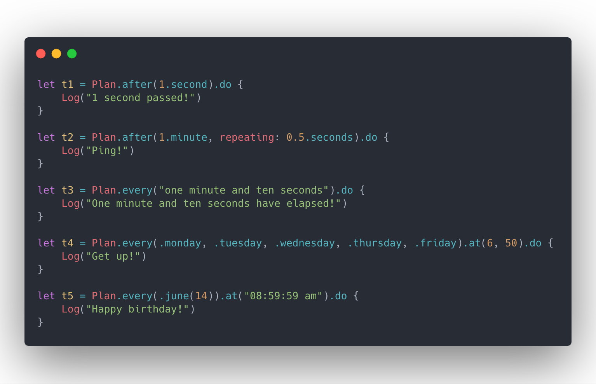

# Schedule([简体中文](README.zh_cn.md))

<p align="center">
<a href="https://github.com/jianstm/Schedule/releases">
  
</a>


</p>

Schedule is a timing tasks scheduler written in Swift. It allows you run timing tasks with elegant and intuitive syntax.

<p align="center">

</p>

## Features

- [x] Elegant and intuitive API 
- [x] Rich preset rules
- [x] Powerful management mechanism
- [x] Detailed execution history
- [x] Thread safe
- [x] Complete documentation
- [x] ~100%+ test coverage

### Why You Should Use Schedule

| Features | Timer | DispatchSourceTimer | Schedule |
| --- | :---: | :---: | :---: |
| ⏰ Interval-based Schedule | ✓ | ✓ | ✓ |
| 📆 Date-based Schedule | ✓ | | ✓ |
| 🌈 Combined Plan Schedule | | | ✓ |
| 🗣️ Natural Language Parse | | | ✓ |
| 🏷 Batch Task Management | | | ✓ |
| 📝 Execution Record | | | ✓ |
| 🎡 Plan Reset | | ✓ | ✓ |
| 🚦 Suspend, Resume, Cancel | | ✓ | ✓ |
| 🍰 Child-action | | | ✓ |

## Usage

### Overview

Scheduling a task has never been so elegant and intuitive, all you have to do is:

```swift
// 1. define your plan：
let plan = Plan.after(3.seconds)

// 2. do your task：
let task = plan.do {
    print("3 seconds passed!")
}
```

### Rules

#### Interval-based Schedule

The running mechanism of Schedule is based on `Plan`, and `Plan` is actually a sequence of `Interval`.

Schedule makes `Plan` definitions more elegant and intuitive by extending `Int` and `Double`. Also, because `Interval` is a built-in type of Schedule, you don't have to worry about it being polluting your namespace.

```swift
let t1 = Plan.every(1.second).do { }

let t2 = Plan.after(1.hour, repeating: 1.minute).do { }

let t3 = Plan.of(1.second, 2.minutes, 3.hours).do { }
```

#### Date-based Schedule

Configuring date-based `Plan` is the same, with the expressive Swift syntax, Schedule makes your code look like a fluent conversation.

```swift
let t1 = Plan.at(date).do { }

let t2 = Plan.every(.monday, .tuesday).at("9:00:00").do { }

let t3 = Plan.every(.september(30)).at(10, 30).do { }

let t4 = Plan.every("one month and ten days").do { }

let t5 = Plan.of(date0, date1, date2).do { }
```

#### Natural Language Parse

In addition, Schedule also supports simple natural language parsing. 

```swift
let t1 = Plan.every("one hour and ten minutes").do { }

let t2 = Plan.every("1 hour, 5 minutes and 10 seconds").do { }

let t3 = Plan.every(.firday).at("9:00 pm").do { }

Period.registerQuantifier("many", for: 100 * 1000)
let t4 = Plan.every("many days").do { }
```

#### Combined Plan Schedule

Schedule provides several basic collection operators, which means you can use them to customize your own powerful plans.

```swift
/// Concat
let p0 = Plan.at(birthdate)
let p1 = Plan.every(1.year)
let birthday = p0.concat.p1
let t1 = birthday.do { 
    print("Happy birthday")
}

/// Merge
let p3 = Plan.every(.january(1)).at("8:00")
let p4 = Plan.every(.october(1)).at("9:00 AM")
let holiday = p3.merge(p4)
let t2 = holiday.do {
    print("Happy holiday")
}

/// First
let p5 = Plan.after(5.seconds).concat(Schedule.every(1.day))
let p6 = s5.first(10)

/// Until
let p7 = P.every(.monday).at(11, 12)
let p8 = p7.until(date)
```

### Management

#### DispatchQueue

When calling `plan.do` to dispatch a timing task, you can use `queue` to specify which `DispatchQueue` the task will be dispatched to when the time is up. This operation does not rely on `RunLoop` like `Timer`, so you can call it on any thread.

```swift
Plan.every(1.second).do(queue: .global()) {
    print("On a globle queue")
}
```


#### RunLoop

If `queue` is not specified, Schedule will use `RunLoop` to dispatch the task, at which point the task will execute on the current thread. **Please note**, like `Timer`, which is also based on `RunLoop`, you need to ensure that the current thread has an **available** `RunLoop`. By default, the task will be added to `.common` mode, you can specify another mode when creating the task.

```swift
let task = Plan.every(1.second).do(mode: .default) {
    print("on default mode...")
}
```

#### Timeline

You can observe the execution record of the task in real time using the following properties.

```swift
task.creationDate

task.executionHistory

task.firstExecutionDate
task.lastExecutionDate

task.estimatedNextExecutionDate
```

#### TaskCenter & Tag

Tasks are automatically added to `TaskCenter.default` by default，you can organize them using tags and task center.

```swift
let plan = Plan.every(1.day)
let task0 = plan.do(queue: myTaskQueue) { }
let task1 = plan.do(queue: myTaskQueue) { }

TaskCenter.default.addTags(["database", "log"], to: task1)
TaskCenter.default.removeTag("log", from: task1)

TaskCenter.default.suspend(byTag: "log")
TaskCenter.default.resume(byTag: "log")
TaskCenter.default.cancel(byTag: "log")

TaskCenter.default.clear()

let myCenter = TaskCenter()
myCenter.add(task0)
```


### Suspend，Resume, Cancel

You can `suspend`, `resume`, `cancel` a task.

```swift
let task = Plan.every(1.minute).do { }

// will increase task's suspensionCount
task.suspend()

// will decrease task's suspensionCount,
// but don't worry about excessive resumptions, I will handle these for you~
task.resume()

// will clear task's suspensionCount
// a canceled task can't do anything, event if it is set to a new plan.
task.cancel()
```

#### Action

You can add more actions to a task and remove them at any time you want:

```swift
let dailyTask = Plan.every(1.day)
dailyTask.addAction {
    print("open eyes")
}
dailyTask.addAction {
    print("get up")
}
let key = dailyTask.addAction {
    print("take a shower")
}
dailyTask.removeAction(byKey: key)
```

## Installation

### CocoaPods

```ruby
# Podfile
use_frameworks!

target 'YOUR_TARGET_NAME' do
  pod 'Schedule', '~> 2.0'
end
```

### Carthage

```
github "jianstm/Schedule" ~> 2.0
```

### Swift Package Manager

```swift
dependencies: [
    .package(
      url: "https://github.com/jianstm/Schedule", .upToNextMajor(from: "2.0.0")
    )
]
```

## Contributing

Like **Schedule**? Thanks!!!

At the same time, I need your help~

### Finding Bugs

Schedule is just getting started. If you could help the Schedule find or fix potential bugs, I would be grateful!

### New Features

Have some awesome ideas? Feel free to open an issue or submit your pull request directly!

### Documentation improvements.

Improvements to README and documentation are welcome at all times, whether typos or my lame English, 🤣.

## Acknowledgement

Inspired by Dan Bader's [schedule](https://github.com/dbader/schedule)!